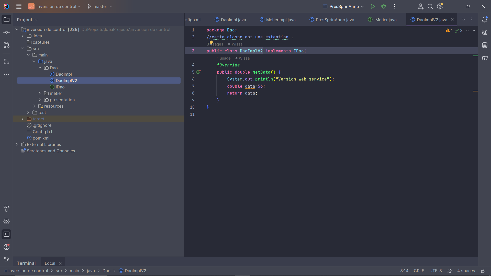
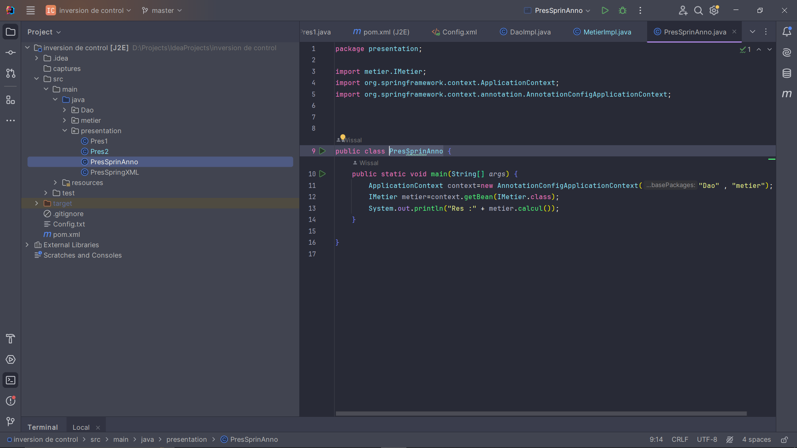

<h1>Compte rendu</h1>
<h2>Inversion de control et injection de dépendances</h2>
<h3>Mon projet utilise le principe d'inversion de contrôle (IoC) et l'injection de dépendances avec Spring, permettant ainsi une gestion efficace et souple des composants. Grâce à cette approche, les dépendances sont gérées de manière transparente, favorisant la modularité et la testabilité du code.</h3>
<h3>La structure de mon projet :</h3>

<h3>L'interface IDao :</h3>
<h4>Cette interface a deux implémentations :</h4>

<h3>L'implementation de IDao version web service :</h3>

<h3>L'implementation de IDao version base de données :</h3>

<h3>L'interface IMetier :</h3>

<h3>L'implementation de IMetier :</h3>

<h2>la couche présentation</h2>
<h3>Injection statique :</h3>

<h3>Injection dynamique:</h3>

<h3>Les deux versions XML et annotations sont des versions pour configurer Spring à faire l'injection de dépendances :</h3>
<h3> 1- Version XML :</h3>

<h3> 2- :wq
Version Annotation :</h3>

